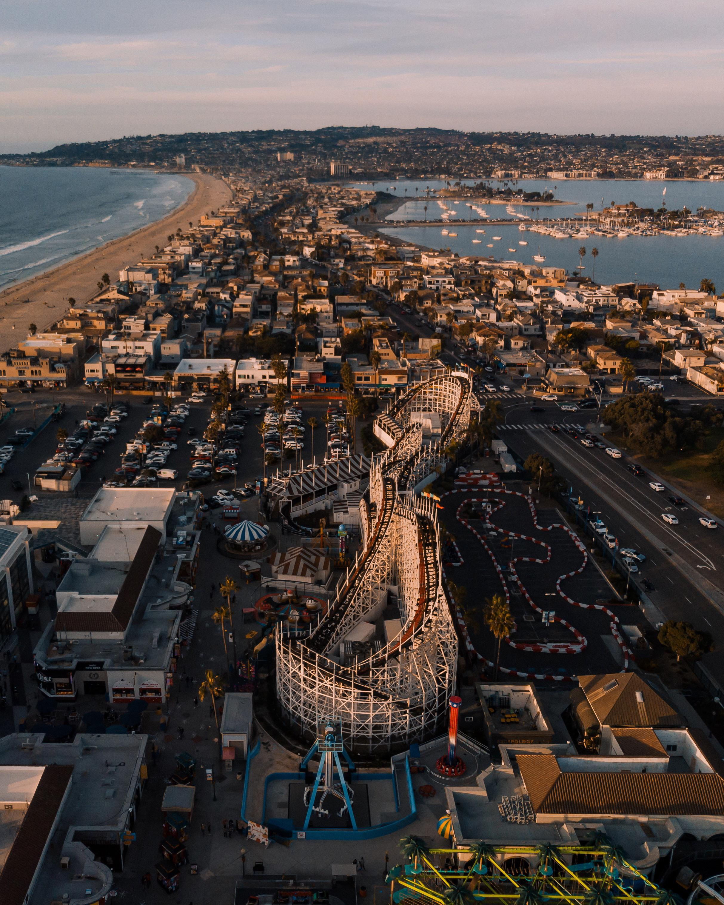

## [Belmont Park](https://www.belmontpark.com/)

Similar vibe to Santa Cruz Beach Boardwalk. Fun for the kids but money spends quick. They have rides and rollercoasters that you can buy tickets to one-by-one, or you can get a day pass. There are other activties like a rock wall, miniature golf, an escape room, etc.

The full list of rides and activities is [here](https://www.belmontpark.com/ride-play/)

### Cost

Parking and entry is free. You can buy rides individually or you can get an unlimited pass for the carnival rides is ~$31~ $56 and ~$21~ $46 (less than 48").

## [Sea World](https://seaworld.com/)

The park features sea animal shows and also has roller coasters. In my opinion the San Diego zoos are a better price and a better experience. If you had to choose one animal experience in San Diego I would choose one of those. If you are specifically interested in the marine life shows, then this is your place.

### Shows

* Orca Encounter: a show highlighting the park's killer whales and various aspects of their lives.
* Dolphin Days: guests can meet the Whale & Dolphin family and learn what inspires their trainers.
* Sea Lions Live: a show that spoofs television shows and music, featuring California sea lions and Asian small-clawed otters.
* Sea Rescue: an indoor theater that shows episodes of ABC's Sea Rescue about SeaWorld efforts saving injured marine animals.

### Roller costers

* Electric Eel: Electric Eel is currently the tallest and fastest roller coaster in San Diego. Electric Eel stands at 150 feet tall, with a track length of 853 feet and speeds of up to 62 miles per hour.
* Journey to Atlantis: The ride stands at a height of 95 feet and contains three drops and an elevator lift. In addition, the ride hits a max speed of 42 mph.
* Emperor: With a height of 153 ft, Emperor will be the tallest, fastest and longest Dive Coaster in California. The ride will contain 2500 feet of track, an immelman loop, 143 foot tall 90 degree drop and will reach speeds over 60 miles per hour.
* Manta: Manta begins with 270 degree projected media experience at the first launch. The train rocks forward and backward in synchronization with the projected film of a coral reef and school of rays. The two-minute, 2,800-foot (850 m) long ride stands at a height of 30 feet (9.1 m) and features a drop of 54 feet (16 m). The layout is characterized by multiple turns, short but sudden drops and crossovers.
* Tidal Twister: The ride reaches a top speed of 30 miles per hour, with a height of 22 feet and a track length of 320 feet.

<a href="https://seaworld.scdn3.secure.raxcdn.com/san-diego/-/media/seaworld-san-diego/images/maps/swc_park-map-summer-2019.ashx?version=1_201906045944" target="_blank">Park map</a>

### Cost

$59 per person, $25 parking