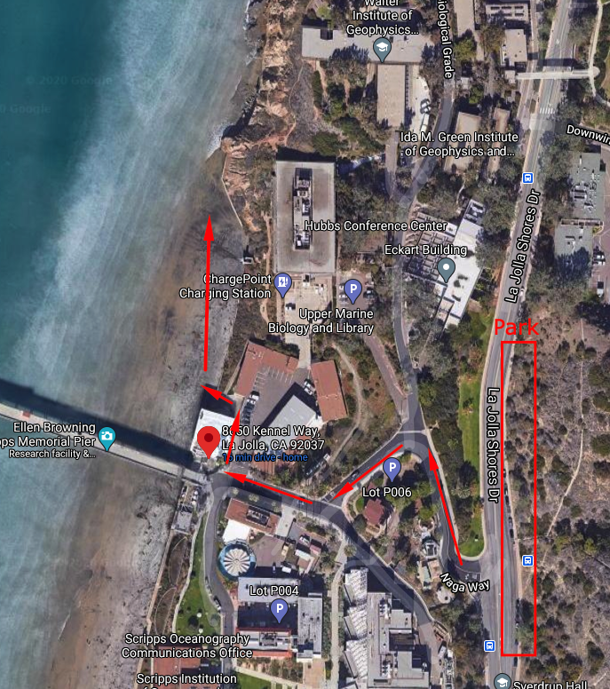

## [Moonlight State Beach](https://www.parks.ca.gov/?page_id=659)

Family friendly beach with a play area, rentals, food, and lifeguards. The beach has a gradual slope so there is a large shallow area for kids.

[400 B St, Encinitas, CA 92024](https://goo.gl/maps/eTwv9LNhobF8bvsd9)

### Activities
Surfing, Sunbathing, Tennis, Volleyball, Bonfires, Beach Walking, Swimming

### Amenities
Lifeguard, Restrooms, Showers, Kids Play Area, Fire Pits, Picnic Tables, Tennis Court, Volleyball Courts, Snack Bar, Grass Park, Rentals

### Cost
Free entry and free parking

## Scripts pier Tidepools.

Tidepooling is best in fall and winder when low tide happens during the day. It's best to go on a day that has negative tides, -1 or more. You should arrive 1 hour before low tide. It can be tricky to find parking here and you can't park at the provided address. Look at the image below for directions.

[Tide Chart](https://magicseaweed.com/Scripps-Pier-La-Jolla-Surf-Report/296/Tide/)

[8650 Kennel Way, La Jolla, CA 92037](https://goo.gl/maps/GWdXdNa7em8D4cGd9)

### Cost

Depends on if you get a ticket or not. Watch what side of the street you park on. Should be free.

## [Tidepooling Adventure by Birch Aquarium](https://aquarium.ucsd.edu/experiences/programs/tidepooling)

Docent lead tidepooling from December to March. Advanced tickets required.

### Cost

$18 per person

## [Shark Snorkel with Birch Aquarium](https://aquarium.ucsd.edu/experiences/programs/shark-snorkeling)

Docent lead snorkeling with leopard sharks from July to September. Advanced tickets required.

### Cost

$25 per person