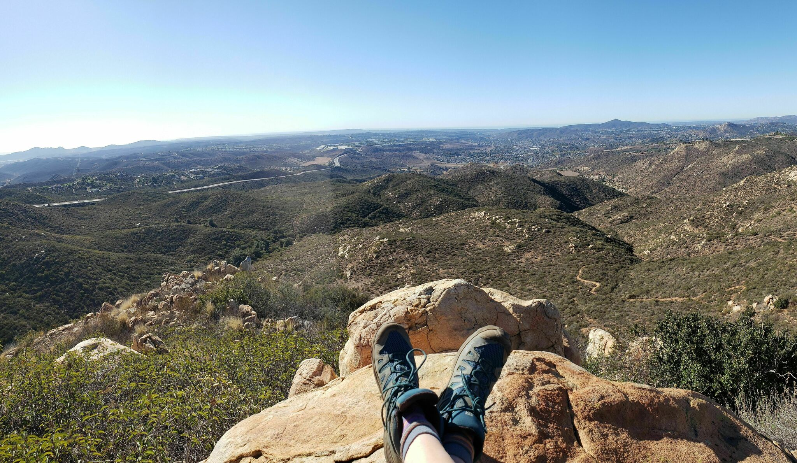
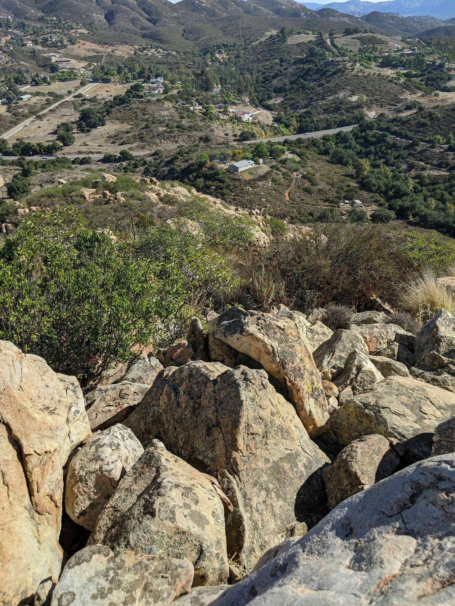
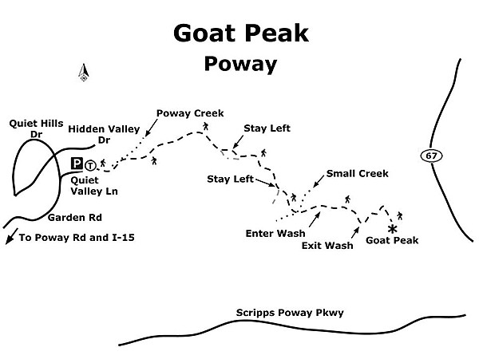
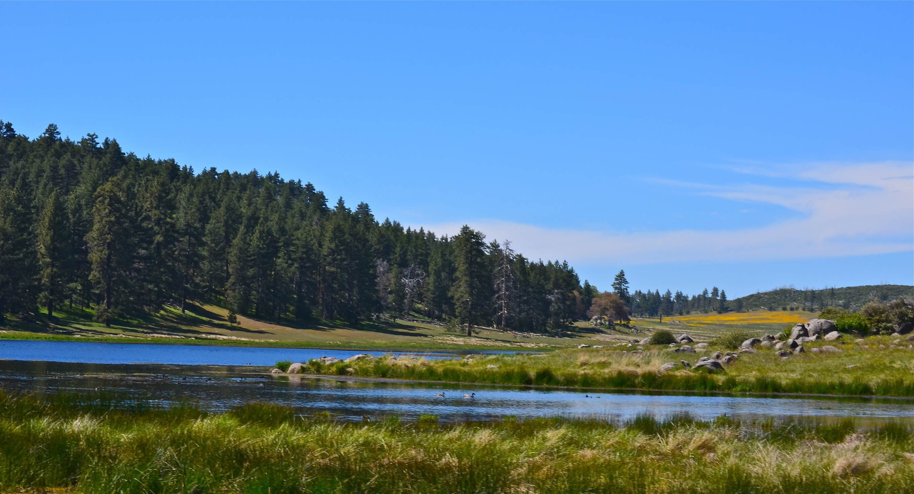
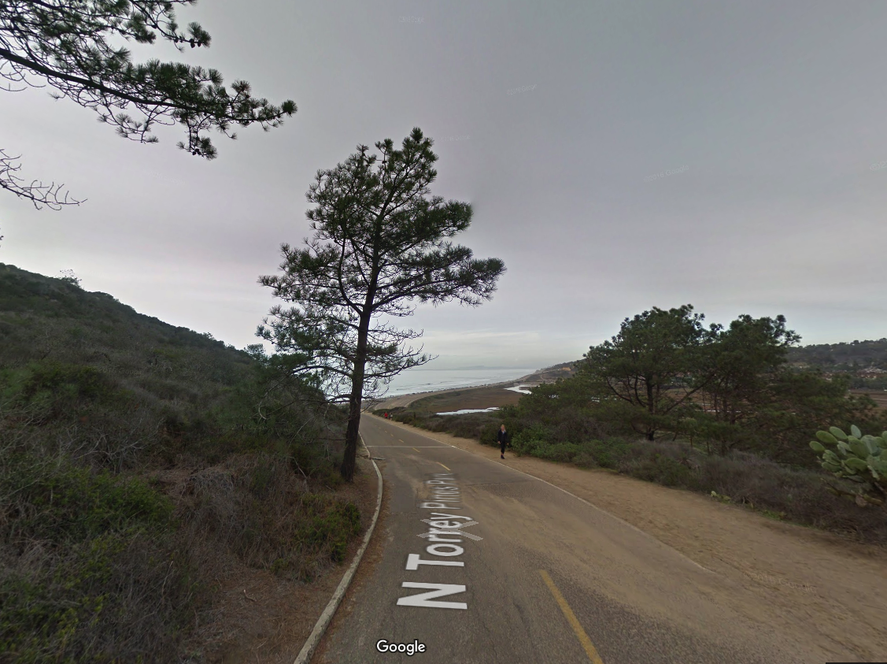
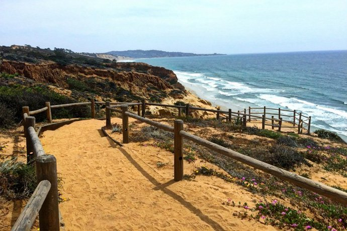
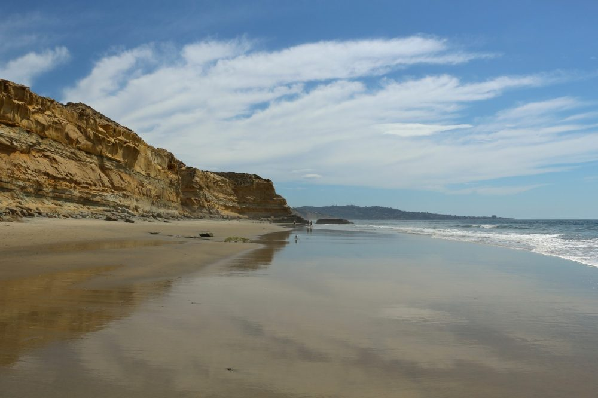
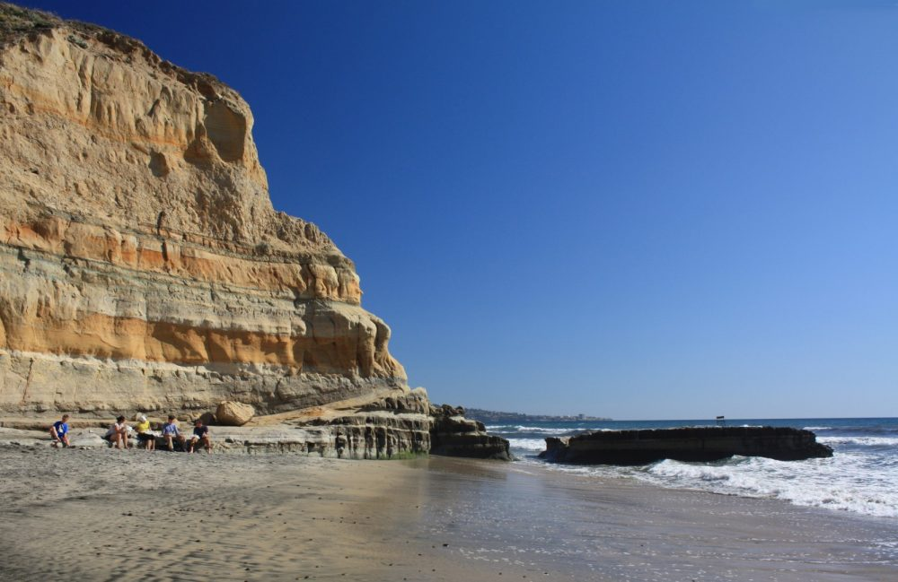

## [Annie's Canyon](http://hikingsdcounty.com/annies-canyon-trail-san-elijo-lagoon/)

Interesting short hike that is perfect for kids.

[126 Solana Point Cir, Solana Beach, CA 92075](https://goo.gl/maps/RmfhiRUVZHDbkKKm8)

### Cost
Free entry and free parking

## [Balboa Park](https://www.balboapark.org/)

Large park with many areas to explore. The San Diego zoo, Air and Space Museum, Natural History Museum and other museums are inside this park.

### Cost

Parking and entry are free.

## [Goat Mountain](https://www.sandiegoreader.com/news/2018/apr/25/roam-its-called-goat-peak-reason/)

3 mi and 1125 ft

Nestled into a quiet neighborhood at the eastern fringes of Poway is a hiking trail that goes through the riparian habitat of Poway Creek, rises steeply up into chaparral slopes, and culminates at a panoramic viewpoint known as Goat Peak. Likely known by locals for years, this trail stays largely under the radar for most everyone else. It provides a shorter alternative to the nearby Iron Mountain with far less of that summit’s crowds. Despite coming in at just over three miles, there are sections of trail steep enough to challenge even the seasoned hiker. Goat Peak can be hiked any time of year.
[Details](https://www.sandiegoreader.com/news/2018/apr/25/roam-its-called-goat-peak-reason/)

### Directions

(Poway) From I-15, exit on Poway Road and go east for 5 miles. Just as Poway Road curves left (north), turn right onto Garden Road and continue 1.6 miles to Quiet Valley Lane. Turn right (east) and go 0.1 mile to the end of the road and park (there is room for several vehicles around the cul-de-sac). No facilities.

[Map](https://goo.gl/maps/CWrJ4PeFK7ouSLqP8)

## Mount Laguna

There are a number of nice trails on Mount Laguna. You can review the list [here](https://www.alltrails.com/us/california/mount-laguna). There are beautiful meadows that are quite large. Mount Laguna is also home to one of the best mountain bike trails in Southern California, Noble Canyon. You can also hike Nobel Canyon trail but watch out for bikes coming quickly down the hill.

[Current closures (see recreation conditions report)](https://www.fs.usda.gov/recmain/cleveland/recreation)

### Cost

You will need a Cleveland National Forest pass that you can buy [here](https://www.recreation.gov/sitepass/74407?q=Cleveland%20National%20Forest%20Digital%20Pass) for $5.

## [Meditation Garden](https://www.yelp.com/biz/self-realization-fellowship-hermitage-and-meditation-gardens-encinitas-2)

Small, beautiful, peaceful garden with ocean views. This is a nice stop when visiting something else in Encinitas.

[215 W K St, Encinitas, CA 92024](https://www.google.com/maps/place/Meditation+Gardens/@33.036572,-117.2968479,17z/data=!3m1!4b1!4m5!3m4!1s0x80dc0c3f72d16853:0xee8b9f63bd2a1e64!8m2!3d33.036572!4d-117.2946539)

### Cost
Free entry and free street parking

## [Torrey Pines State Reserve](https://www.sandiego.org/articles/parks-gardens/torrey-pines-state-natural-reserve-park.aspx)

Nice place to take a short hike. Beautiful views of the ocean and erosion making interesting designs in the sandstone.

You can see some nice views with anything from a [5 minute walk](#5-minute-walk-to-views) or a [2.4 mile hike up the hill and back on the beach](#beach-loop). Or, if it's low tide, you can stick to the beach and take anywhere from a 5-11 mile walk on the beach.

They charge for parking but we have a free parking pass for one car if you want to borrow it and go.

### 5 minute walk to views

Use our annual pass to park at the top of the hill and walk out to see the views from above.

### Beach loop

Walk up a fairly steep paved road to the top of the hill to enjoy beautiful views as you explore the trail and its offshoots the eventually lead down the the beach. Then walk back to the car along the beach.

[Details](https://www.hikingproject.com/trail/7022596/torrey-pines-state-reserve-loop)

### Beach Walk

Walk up to 11 miles on the beach assuming the tide is low enough. We normally walk about 5 miles from Torrey Pines State Park until we get to the nude beach then turn around and go back. [This article](https://www.sandiegoreader.com/news/2017/mar/01/roam-la-jolla-shores-beach-torrey-pines/) describe a longer route in the reverse direction.

## [Sunshine Gardens](https://www.yelp.com/biz/sunshine-gardens-encinitas)

A fun place to stop with the kids that has goats, birds, a big, a tortoise, and koi tanks. It's just a nursery that also has animals to see but makes for a fun stop when you are in Encinitas. The koi fish are a different business on the same location. You can spend up to 30 min here.

[155 Quail Gardens Dr, Encinitas, CA 92024](https://goo.gl/maps/Pe85gCtxpoKvXu9K9)

### Cost

Free entry and parking
